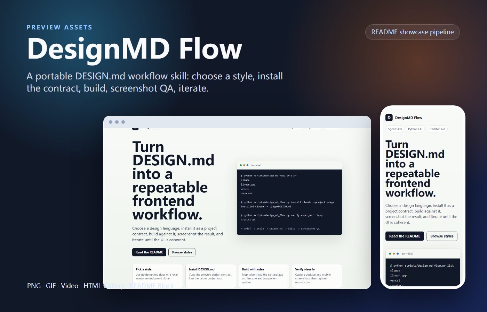
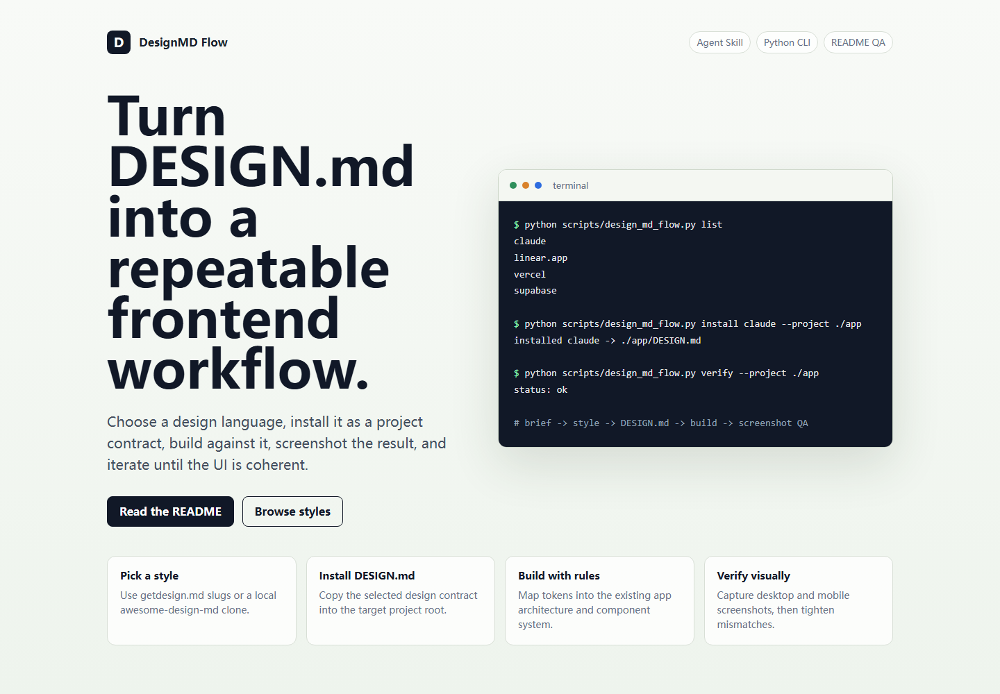
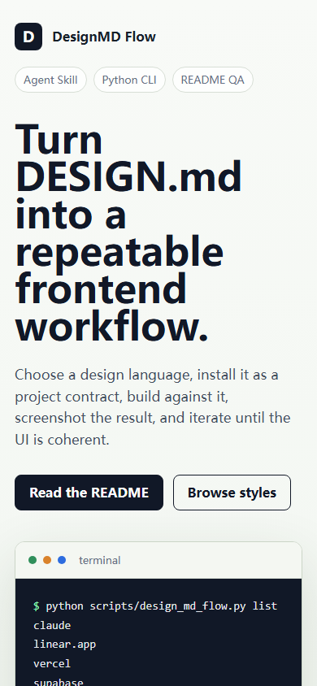

<div align="center">
  <h1>DesignMD Flow</h1>
  <p><strong>Pick a DESIGN.md style, install it into a project, build against it, screenshot-QA the result, and iterate.</strong></p>
  <p>
    <a href="https://github.com/Harzva/design-md-flow/actions/workflows/ci.yml"></a>
    
    
    <a href="LICENSE"></a>
  </p>
  <p>
    <a href="#quick-start">Quick Start</a> |
    <a href="#workflow">Workflow</a> |
    <a href="docs/readme-assets/gallery.html">Preview Gallery</a> |
    <a href="https://getdesign.md/">Browse DESIGN.md styles</a>
  </p>
</div>

<!-- showcase:start -->
<p align="center">
  
</p>

<p align="center">
  <a href="docs/readme-assets/gallery.html">Preview Gallery</a>
</p>

| Desktop workflow preview | Mobile workflow preview |
| --- | --- |
|  |  |
<!-- showcase:end -->

## Why

`DESIGN.md` is a simple design-system file that AI coding agents can read before building UI. Google Stitch popularized the format and workflow; [awesome-design-md](https://github.com/VoltAgent/awesome-design-md) and [getdesign.md](https://getdesign.md/) provide ready-to-use examples inspired by public websites.

DesignMD Flow adds the missing operating layer:

1. choose a visual language,
2. install `DESIGN.md` into the project root,
3. build UI against the design contract,
4. verify with desktop/mobile screenshots,
5. revise the contract or code until the interface is coherent.

It is intentionally small: one agent skill, one dependency-free Python helper, and a README showcase pipeline.

## Quick Start

Use it as a standalone helper:

```bash
git clone https://github.com/Harzva/design-md-flow.git
cd design-md-flow

python scripts/design_md_flow.py list
python scripts/design_md_flow.py show claude
python scripts/design_md_flow.py install claude --project ../my-app
python scripts/design_md_flow.py verify --project ../my-app
```

Use a local `awesome-design-md` clone for faster, reproducible installs:

```bash
git clone --depth 1 https://github.com/VoltAgent/awesome-design-md.git .cache/awesome-design-md
python scripts/design_md_flow.py install vercel --project ../my-app --source .cache/awesome-design-md
```

Use it as an agent skill:

```bash
# Agent Skills CLI, when available
npx skills add Harzva/design-md-flow --global

# Universal manual install
git clone https://github.com/Harzva/design-md-flow.git ~/.codex/skills/design-md-flow
```

Windows manual install:

```powershell
git clone https://github.com/Harzva/design-md-flow.git $env:USERPROFILE\.codex\skills\design-md-flow
```

## Workflow

| Step | What happens | Output |
| --- | --- | --- |
| Choose | Pick a style slug such as `claude`, `vercel`, `linear.app`, `apple`, or `supabase`. | Clear style direction |
| Install | Copy or download the matching `DESIGN.md` into a target project. | `PROJECT/DESIGN.md` |
| Build | Ask the agent to treat `DESIGN.md` as the design contract. | UI matching documented tokens and rules |
| Verify | Capture desktop and mobile screenshots. | Visual QA evidence |
| Iterate | Tighten code or adapt `DESIGN.md` for the product. | Project-specific design system |

Implementation prompt:

```text
Use the project root DESIGN.md as the design contract. Build the requested UI.
Preserve the existing architecture. Match the documented color roles, typography,
component styling, spacing, responsive behavior, and do/don't guardrails.
Verify with desktop and mobile screenshots, then iterate until the UI reads as
the selected visual language without copying protected brand assets.
```

## Commands

| Command | Purpose |
| --- | --- |
| `python scripts/design_md_flow.py list` | List available style slugs from GitHub. |
| `python scripts/design_md_flow.py show <slug>` | Print metadata and source links for a style. |
| `python scripts/design_md_flow.py install <slug> --project <path>` | Install `DESIGN.md` into a project. |
| `python scripts/design_md_flow.py verify --project <path>` | Check whether the project has a usable `DESIGN.md`. |
| `python scripts/design_md_flow.py open <slug>` | Open the style page on getdesign.md. |

The helper refuses to overwrite an existing `DESIGN.md` unless `--overwrite` is passed.

## Quality Bar

DesignMD Flow is built for public repositories and repeatable agent work:

- **Professional:** tested commands, CI, truthful claims, narrow scope.
- **Beautiful:** first-screen README preview, clear workflow diagrams, polished screenshots.
- **Universal:** no private tokens, no local absolute paths, no account-specific assumptions, Windows/macOS/Linux friendly commands.

## Project Structure

```text
design-md-flow/
  SKILL.md                         # Agent workflow instructions
  scripts/design_md_flow.py         # Dependency-free helper CLI
  references/workflow.md            # Deeper workflow guidance
  docs/preview.html                 # Static preview used for README assets
  docs/readme-assets/               # Generated hero, screenshots, gallery
  tests/                            # Stdlib unit tests
  .github/workflows/ci.yml          # Cross-platform CI
```

## Development

```bash
python -m unittest discover -s tests
python scripts/design_md_flow.py --help
python scripts/design_md_flow.py list
```

Regenerate README visuals:

```bash
node <readme-showcase-screenshot>/scripts/capture-static.mjs --config showcase.config.json
node <readme-showcase-screenshot>/scripts/compose-hero.mjs --config showcase.config.json
node <readme-showcase-screenshot>/scripts/build-preview-gallery.mjs --config showcase.config.json
node <readme-showcase-screenshot>/scripts/verify-showcase.mjs --config showcase.config.json
```

## Attribution

- [Google Stitch skills](https://github.com/google-labs-code/stitch-skills) define the DESIGN.md-oriented agent skill direction.
- [VoltAgent awesome-design-md](https://github.com/VoltAgent/awesome-design-md) and [getdesign.md](https://getdesign.md/) provide curated public style examples.

DesignMD Flow is a workflow wrapper. It does not grant rights to copy third-party logos, trademarks, proprietary assets, or protected brand material.

## License

[MIT](LICENSE)
